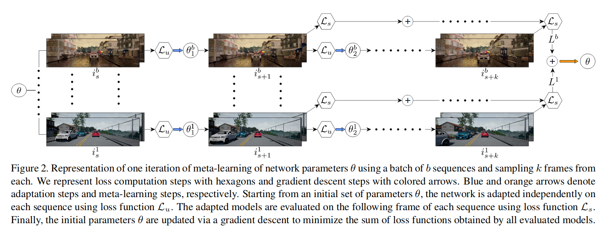

# Learning2AdaptForStereo
Code for [Learning To Adapt For Stereo](https://arxiv.org/pdf/1904.02957) accepted at CVPR2019



**Abstract**

Real world applications of stereo depth estimation require models that are robust to dynamic variations in the environment. Even though deep learning based stereo methods are successful, they often fail to generalize to unseen variations in the environment, making them less suitable for practical applications such as autonomous driving. In this work, we introduce a” learning-to-adapt” framework that enables deep stereo methods to continuously adapt to new target domains in an unsupervised manner. Specifically, our approach incorporates the adaptation procedure into the learning objective to obtain a base set of parameters that are better suited for unsupervised online adaptation. To further improve the quality of the adaptation, we learn a confidence measure that effectively masks the errors introduced during the unsupervised adaptation. We evaluate our method on synthetic and real-world stereo datasets and our experiments evidence that learning-to-adapt is, indeed beneficial for online adaptation on vastly different domains.

[Paper](https://arxiv.org/abs/1904.02957)

If you use this code please cite:
```
@InProceedings{Tonioni_2019_CVPR,
    title={Learning to adapt for stereo},
    author={Tonioni, Alessio and Rahnama, Oscar and Joy, Tom and Di Stefano, Luigi and Thalaiyasingam, Ajanthan and Torr, Philip},
    booktitle = {The IEEE Conference on Computer Vision and Pattern Recognition (CVPR)},
    month = {June},
    year = {2019}    
}
```

## Requirements
This software has been tested with python3 and tensorflow 1.11. All required packages can be installed using `pip` and `requirements.txt`

```bash
pip3 install -r requirements.txt
```

## Data Preparation
This software is based on stereo video sequences.
Each sequence must be described by a `csv` file with the absolute paths of the images that need to be loaded. An example of such file is `example_sequence.csv`.

Each row should contain absolute paths to the input data for one video frame. The paths should be comma separated and follow this order:

"*path_to_left_rgb*,*path_to_right_rgb*,*path_to_groundtruth*"

The data loader for left and right frames handle all image types supported by tensorflow (i.e., `jpg`,`png`,`gif`,`bmp`). The ground truth files supported are either  `png` or `pfm`  containing disparity values. When using `png`, if the file has `16 bit` of precision, the raw values are divided by `256.0` to get the true disparities following KITTI's convention.

Finally the `train.py` scripts load a dataset of video sequences through another `csv` file with the list of video to load. An example is `example_dataset.csv` for the `KITTI` dataset.

## Training
Training using meta learning for stereo adaptation is implemented in the `train.py` script. All the options are controleld via command line arguments. An help message for the available options is displayed with:

```bash
python3 train.py -h
```

An example of meta training with L2A+Wad:
```bash
OUT_FOLDER="./training/L2AWad"
DATASET="./example_seuqence.csv"
BATCH_SIZE="4"
ITERATIONS=50000
PRETRAINED_WEIGHTS="/mnt/pretrained_CNN/dispnet/synthetic/weights.ckpt"
ADAPTATION_ITERATION="2"
LR="0.00001"
ALPHA="0.00001"
LOSS="mean_l1"
ADAPTATION_LOSS="mean_SSIM_l1"
META_ALGORITHM="L2AWad"


python3 train.py --dataset $DATASET -o $OUT_FOLDER -b $BATCH_SIZE -n $ITERATIONS --adaptationSteps $ADAPTATION_ITERATION --weights $PRETRAINED_WEIGHTS --lr $LR --alpha $ALPHA --loss $LOSS --adaptationLoss $ADAPTATION_LOSS --unSupervisedMeta --metaAlgorithm $META_ALGORITHM --maskedGT
```

**Meta_Algorithm** available:
+ `FineTuner`: Traditional fine tuning on batch of stereo frames using `$LOSS`
+ `L2A`: Meta learning through 'learning to adapt for stereo' as described in eq. 3, section 3.1 in the main paper.
+ `FOL2A`: First order approximation fo `L2A` as described in section 2.2 in the supplementary material.
+ `L2AWad`: Meta learning through 'learning to adapt for stereo' + confidence weighted adaptation as described in eq. 5, section 3.2 in the main paper.

## Testing
Once trained the network can be tested using theb `test.py` script. All the options are controleld via command line arguments. An help message for the available options is displayed with:

```bash
python3 test.py -h
```

An example evaluation for a model trained with `L2AWad`:
```bash
SEQUENCE_LIST="./example_sequence.csv"
OUTPUT="./result/kitti"
WEIGHTS="./training/L2AWad/weights.ckpt"
MODE="WAD"

python3 test.py --sequence $SEQUENCE_LIST --output $OUTPUT --weights $WEIGHTS --mode $MODE --prefix model/
```
**Adaptation mode**:
+ `AD`: standard online adaptation with unsupervised left right consistency loss.
+ `WAD`: confidence weighted online adaptation (requires weights obtained training with `L2AWad`).
+ `SAD`: standard online adaptation with supervised L1 loss using groundtruth.
+ `NONE`: no adaptation, only inference.

## Pretrained nets
All the experiments in the paper start the training from a Dispnet pretrained on synthetic data.
These weights are available [here](https://drive.google.com/open?id=1GwGxBOFx-NlUo9RAUgPlgPvaHCpGedlm).